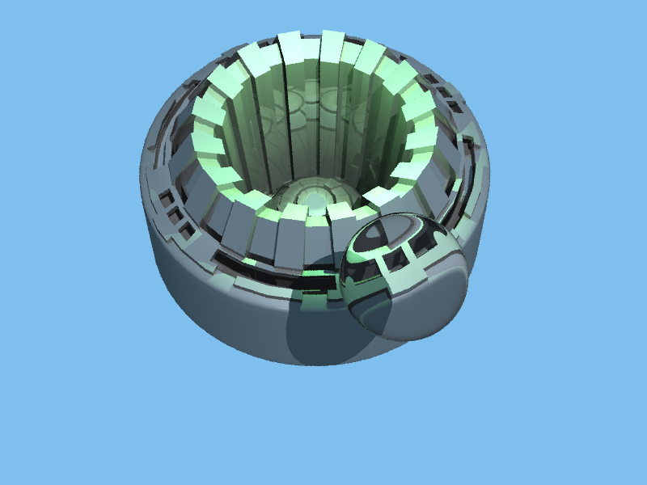

# Ray Tracer

**Ray-tracing application with triangle meshes, complex lighting and scenes.**

Developed in c++ with stb_image library.

**Target Platform**: Linux

**Usage:** 

- Run make file.
- ./ray scene.txt (bvh) (parallel)
- use flag "t" to enable bvh and parallel

### Work result

**Refraction:** Before/After

**Jittered Supersampling:** Before/After

**Speedup:**

- Parallelism: OpenMP used.
- Geometric grouping structure: Bounding volume hierarchy tree structure adopted to reduce the time complexity in ray-object collision detection to the logarithmic of total objects in the scene.